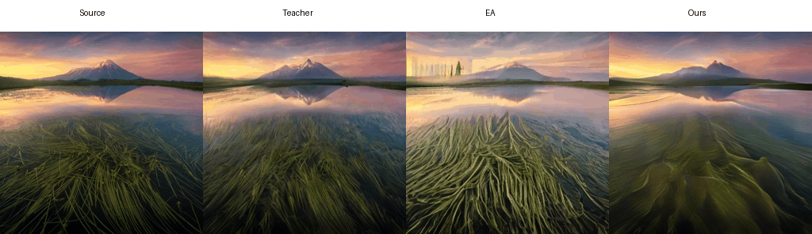

# Hybrid Attention Mechanism with Decoupled Distillation



[](https://doi.org/YOUR_ZENODO_DOI)

**Note:** This is the official implementation of the manuscript **"Efficient Controllable Diffusion via Dynamic Hybrid Attention and Decoupled Knowledge Distillation"**, currently submitted to **The Visual Computer**.

## 📖 Introduction

In the realm of image-to-image translation, diffusion models often face a trade-off between generation quality and computational efficiency. To address this, we introduce:

1. **Dynamic Hybrid Attention (DHA):** A mechanism that synergizes the high-fidelity local modeling of Self-Attention with the efficient global context aggregation of External Attention.
2. **Decoupled Knowledge Distillation (DKD):** A training framework designed to effectively train this heterogeneous architecture.

Our approach achieves up to a **1.3x speedup** and reduces peak GPU memory by **8%--54.5%** during inference, while maintaining nearly indistinguishable quality and full controllability compared to the original model.

## 🚀 Quick Start Guide

### 1. Environment Setup

We recommend creating and activating an isolated virtual environment using Conda.

```bash
# 1. Create and activate the Conda environment
conda create -n DKD python=3.8
conda activate DKD

# 2. Install PyTorch and related dependencies (adjust according to your CUDA version)
conda install pytorch==2.0.1 torchvision==0.15.2 torchaudio==2.0.2 pytorch-cuda=11.7 -c pytorch -c nvidia

# 3. Install all other required libraries
pip install -r requirements.txt

```

### 2. Data & Pre-trained Model Preparation

#### Dataset

Image-text pairs are required for training. You can prepare a dataset like **LAION Aesthetics 6.5+** and organize it using the following structure:

```text
DKD/
└── datasets/
    └── training_data/
        ├── image/       # Source images
        │   ├── 000000000.jpg
        │   └── ...
        └── prompt/      # Corresponding text prompts
            ├── 000000000.txt
            └── ...

```

#### Pre-trained Models

The following two pre-trained models are required. Please download them and place them in the correct folders.

**1. Stable Diffusion v2-1-base**

* **Download:** [HuggingFace Link](https://www.google.com/search?q=https://huggingface.co/stabilityai/stable-diffusion-2-1-base/tree/main)

* **Target Path:** `./models/v2-1_512-ema-pruned.ckpt`


**2. OpenCLIP**

* **Download:** [HuggingFace Link](https://www.google.com/search?q=https://huggingface.co/laion/CLIP-ViT-H-14-laion2B-s32B-b79K/tree/main)

* **Target Path:** `./models/CLIP-ViT-H-14/open_clip_pytorch_model.bin`


### 3. Model Training & Distillation

We provide scripts for both standard training and knowledge distillation.

* **Standard Training:** Run the primary training script for the backbone architecture.

```bash
  python fcdiffusion_train.py

```

* **Decoupled Knowledge Distillation (DKD):** To train the efficient student model, configure the `teacher_model_path`, `dataset_path`, and `output_path` inside `fcdiffusion_distill_final.py`, then run:


```bash
  python fcdiffusion_distill_final.py

```

### 4. Model Testing & Inference

Use the provided testing scripts to evaluate the models on your source images.

* **Teacher/Baseline Inference:**

```bash
  python fcdiffusion_test.py

```

* **Student Model Inference (DHA-based):** Open `fcdiffusion_test_student.py` to configure the `student_model_path`, `input_image_path`, and `output_dir`, then run:


```bash
  python fcdiffusion_test_student.py

```

### 5. Evaluation Metrics

The `scripts/` directory contains all necessary tools to compute quantitative benchmarks for generated visual assets. After generating your test dataset, you can calculate the following metrics using the respective scripts:

* **CLIP Score:** Evaluates text-image alignment.
* **DINO (ViT-s16):** Evaluates structural and semantic consistency.
* **BRISQUE:** Evaluates blind/no-reference image spatial quality.

## 📌 Citation

If you find this code useful for your research, please consider citing our paper:

```bibtex
@article{Zhu2025Hybrid,
  title={Hybrid Attention Mechanism with Decoupled Distillation: Enhancing Efficiency and Fidelity in Diffusion Models},
  author={Zhu, Aihua and Su, Rui and Zhao, Qingling and Feng, Li},
  journal={The Visual Computer (Under Review)},
  year={2025}
}
